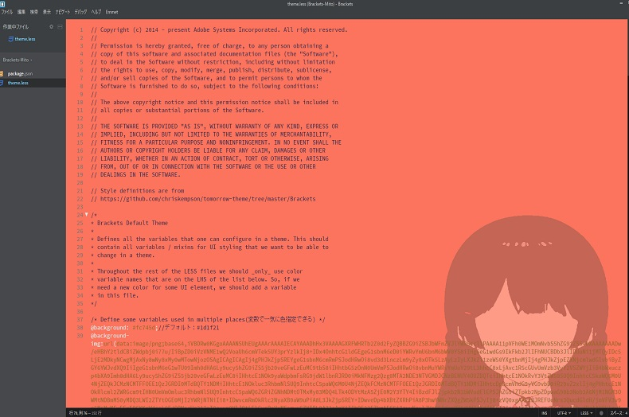

# Brackets-Mito

## Overview（概要）

■Explanation of English

"Brackets-Mito" is a customization theme plug-in that can be used with the source code editor "Brackets".

I made Tsukino Mito Virtual Liver belonging to Ichikara Inc. as a model, and the color of the editor screen chose a red color close to the image color of the character.

By the way, this theme is an informal theme.

■日本語の説明

「Brackets-Mito」は、ソースコードエディタ「Brackets」で利用できるカスタマイズテーマプラグインです。

いちから株式会社所属のバーチャルライバー月ノ美兎さんをモデルに作っており、エディタ画面の色は、キャラのイメージカラーに近しい赤っぽい色を選びました。

※ちなみに本テーマは非公式テーマです。
